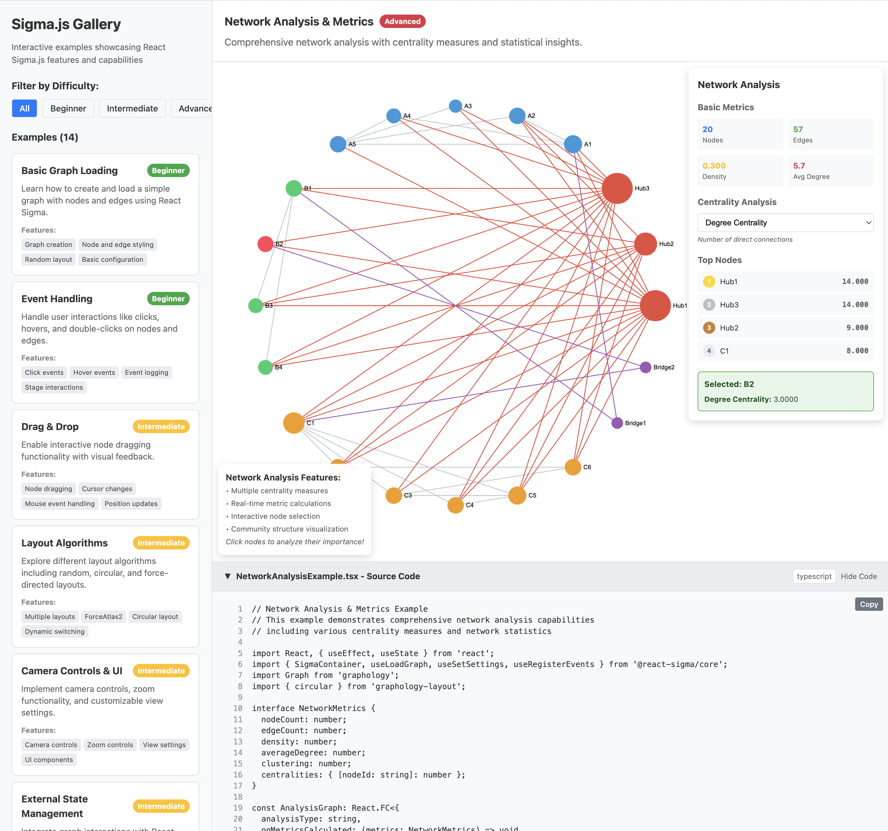

# Sigma.js Gallery

A comprehensive collection of interactive examples showcasing React Sigma.js features and capabilities for graph visualization. This gallery demonstrates everything from basic graph creation to advanced network analysis, with 14 fully-functional examples covering beginner to expert-level concepts.




## 🚀 Getting Started

```bash
# Install dependencies
npm install

# Start development server
npm run dev

# Build for production
npm run build

# Run linting
npm run lint
```

Open [http://localhost:5173](http://localhost:5173) to view the gallery in your browser.

## 📊 Visualization Examples

### 🟢 Beginner Level

#### 1. Basic Graph Loading
- **File**: `src/components/examples/SimpleBasicExample.tsx`
- **What it demonstrates**: Fundamental graph creation and rendering
- **Key concepts**: Graph instantiation, node/edge attributes, random layout, Sigma settings
- **Interesting features**: Step-by-step commented code showing the complete workflow from empty graph to rendered visualization

#### 2. Event Handling  
- **File**: `src/components/examples/EventsExample.tsx`
- **What it demonstrates**: User interaction with graph elements
- **Key concepts**: Click events, hover events, event propagation, real-time logging
- **Interesting features**: Live event log showing all interactions, demonstrates event bubbling from nodes to stage

### 🟡 Intermediate Level

#### 3. Drag & Drop
- **File**: `src/components/examples/DragDropExample.tsx` 
- **What it demonstrates**: Interactive node manipulation
- **Key concepts**: Mouse event handling, cursor changes, position updates, visual feedback
- **Interesting features**: Cursor changes on hover, maintains edge connections during drag operations

#### 4. Layout Algorithms
- **File**: `src/components/examples/LayoutsExample.tsx`
- **What it demonstrates**: Different graph layout strategies
- **Key concepts**: ForceAtlas2 physics simulation, circular positioning, random distribution, dynamic layout switching
- **Interesting features**: Live layout switching with smooth transitions, demonstrates how layout algorithms affect network perception

#### 5. Camera Controls & UI
- **File**: `src/components/examples/ControlsExample.tsx`
- **What it demonstrates**: Navigation and viewport management
- **Key concepts**: Camera manipulation, zoom controls, view transforms, programmatic navigation
- **Interesting features**: Smooth animated camera movements, zoom level tracking, programmatic view reset

#### 6. External State Management
- **File**: `src/components/examples/ExternalStateExample.tsx`
- **What it demonstrates**: Integration with React state ecosystem
- **Key concepts**: State synchronization, dynamic styling, selection management, statistics display
- **Interesting features**: Two-way data binding between graph interactions and React state, dynamic node highlighting

### 🔴 Advanced Level

#### 7. Graph Search & Filtering
- **File**: `src/components/examples/GraphSearchExample.tsx`
- **What it demonstrates**: Interactive data exploration and filtering
- **Key concepts**: Text search algorithms, result highlighting, stable positioning, industry categorization
- **Interesting features**: Fixed node positions prevent layout shifts during search, multi-criteria filtering, result highlighting

#### 8. Minimap Navigation
- **File**: `src/components/examples/MinimapExample.tsx`
- **What it demonstrates**: Custom canvas-based navigation aids
- **Key concepts**: Canvas rendering, coordinate transformation, viewport indication, click-to-navigate
- **Interesting features**: Custom minimap implementation using HTML5 Canvas, real-time viewport updates

#### 9. Advanced Styling & Themes
- **File**: `src/components/examples/AdvancedStylingExample.tsx`
- **What it demonstrates**: Sophisticated visual customization and theming
- **Key concepts**: Dynamic theme switching, importance-based node sizing, organizational hierarchies, color schemes
- **Interesting features**: Multiple theme support (Default, Dark, Ocean, Sunset), node sizes reflect organizational importance, hierarchical color coding

#### 10. Dynamic Data Loading  
- **File**: `src/components/examples/DynamicDataExample.tsx`
- **What it demonstrates**: Real-time data updates and live network monitoring
- **Key concepts**: Time-series data, animated transitions, playback controls, live metrics
- **Interesting features**: Server network simulation with real-time updates, playback speed control, network health monitoring

#### 11. Network Analysis & Metrics
- **File**: `src/components/examples/NetworkAnalysisExample.tsx`
- **What it demonstrates**: Graph theory and network analysis algorithms
- **Key concepts**: Centrality measures (degree, closeness, betweenness, eigenvector), clustering coefficient, network density
- **Interesting features**: Interactive centrality calculation, visual representation of node importance, comprehensive network statistics

#### 12. Multi-Graph Comparison
- **File**: `src/components/examples/MultiGraphExample.tsx` 
- **What it demonstrates**: Comparative visualization of different network topologies
- **Key concepts**: Network topology types, structural comparison, grid layouts, multiple graph instances
- **Interesting features**: Side-by-side comparison of 6 different network types (social, hierarchical, random, star, ring, small-world)

#### 13. Animated Transitions
- **File**: `src/components/examples/AnimatedExample.tsx`
- **What it demonstrates**: Smooth animations and temporal network evolution
- **Key concepts**: Network growth simulation, layout morphing, filtering animations, temporal data
- **Interesting features**: 4 distinct animation patterns, smooth interpolation between layouts, network evolution over time

#### 14. Property Graph (Neo4j Style)
- **File**: `src/components/examples/PropertyGraphExample.tsx`
- **What it demonstrates**: Labeled property graphs with rich metadata
- **Key concepts**: Node labels, relationship types, directed edges, property inspection, graph databases
- **Interesting features**: Neo4j-style visualization, click-to-inspect properties, multi-label nodes, relationship direction indicators

## 🛠 Technology Stack

- **React 19**: Latest React with hooks and modern patterns
- **TypeScript**: Full type safety and better development experience
- **Vite**: Fast build tool and development server
- **Sigma.js 3**: Modern graph visualization library
- **React Sigma**: React bindings for Sigma.js
- **Graphology**: Graph data structure and algorithms

## 📦 Dependencies

### Core Dependencies
- `@react-sigma/core`: React components for Sigma.js
- `@react-sigma/layout-forceatlas2`: ForceAtlas2 layout algorithm
- `sigma`: Core Sigma.js library
- `graphology`: Graph data structures
- `graphology-layout`: Graph layout algorithms
- `graphology-layout-forceatlas2`: ForceAtlas2 implementation
- `graphology-generators`: Graph generation utilities

## 🎨 Features

- **Interactive Gallery**: Browse examples by difficulty level
- **Live Examples**: All examples run in real-time with interactive controls
- **Clean Code**: Well-structured, documented, and TypeScript-typed code
- **Responsive Design**: Works on desktop and mobile devices
- **Educational**: Each example includes descriptions and feature lists
- **Comprehensive**: Covers all major React Sigma.js use cases

## 📚 Learning Resources

- [Sigma.js Documentation](https://www.sigmajs.org/docs/)
- [React Sigma Documentation](https://sim51.github.io/react-sigma/)
- [Graphology Library](https://github.com/graphology/graphology)

## 🤝 Contributing

Feel free to contribute by:
1. Adding new examples
2. Improving existing examples
3. Fixing bugs
4. Improving documentation
5. Adding new features

## 📄 License

This project is open source and available under the MIT License.

## 🎯 Example Use Cases

This gallery demonstrates patterns for:
- **Social Networks**: Node relationships and clustering
- **Corporate Networks**: Company partnerships and industries  
- **Data Visualization**: Interactive exploration of complex datasets
- **Scientific Visualization**: Research networks and citations
- **System Architecture**: Component dependencies and relationships
- **Knowledge Graphs**: Concept relationships and hierarchies

## 🔧 Customization

Each example is self-contained and can be easily:
- Modified for specific use cases
- Extended with additional features  
- Integrated into existing React applications
- Styled with custom themes and colors
- Enhanced with additional interactivity

Start exploring the gallery to see the power of React Sigma.js in action!
